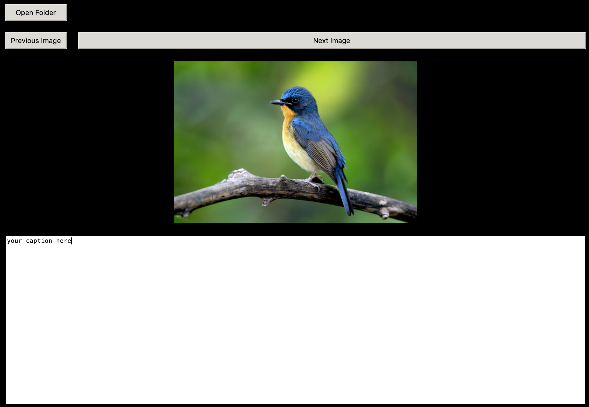

# manual-captioning-helper
The Image Tagger application is a Python script that allows you to tag images within a folder using a graphical user interface (GUI). It provides functionality to open a folder, navigate between images, annotate the images, and save the annotations.



## Requirements

- Python (3.6 or higher)
- PIL (Python Imaging Library)
- Tkinter (Included with Python)

## Installation

1. Clone the repository or download the source code files.
2. Ensure that you have Python and the required dependencies installed.
3. Install the dependencies by running the following command:
   ```shell
   pip install pillow
   
# Usage

1. Run the script `image_tagger.py` using Python.
2. Click the "Open Folder" button to select a folder containing images for tagging. Only images with extensions `.png`, `.jpg`, and `.jpeg` will be considered.
3. The application will display the first image in the folder along with an empty textbox for annotation.
4. Type your annotation in the textbox.
5. Click the "Next Image" button to move to the next image in the folder. The current annotation will be saved automatically.
6. Click the "Previous Image" button to move back to the previous image. The current annotation will be saved automatically.
7. To save the current annotation without navigating to the next or previous image, click the "Save Annotation" button.
8. Annotations are saved in separate text files with the same name as the corresponding images, but with a `.txt` extension.
9. The application allows you to load existing annotations for each image if a corresponding text file is found in the folder.
10. Close the application window to exit the image tagger.
